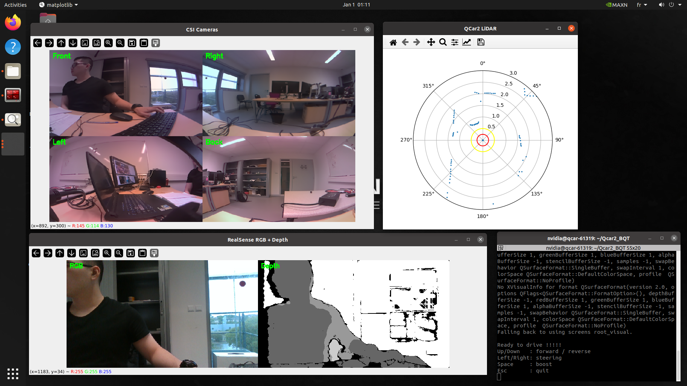
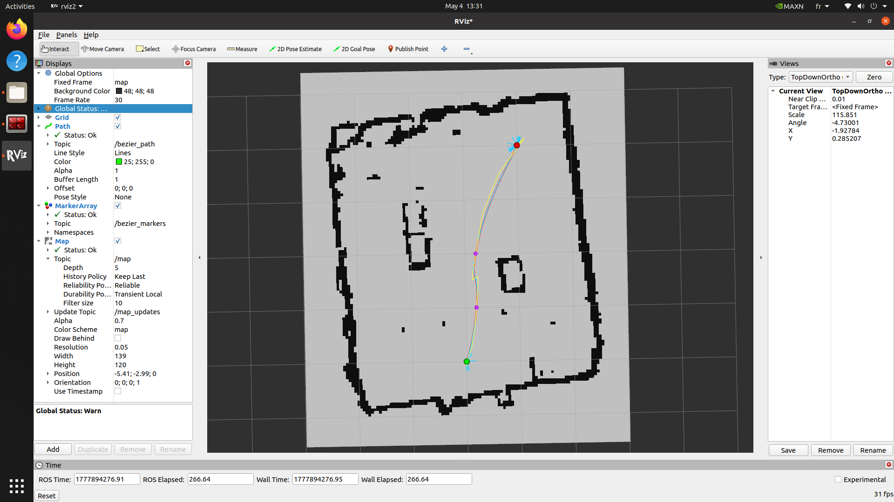

# Results

This folder contains screenshots and video results from the QCar2 ROS 2 autonomous navigation project.

## Sensor Visualization

Visualization of QCar2 sensor data, including CSI cameras, RealSense RGB-D camera, and LiDAR data.

## Bezier Trajectory Visualization

Bezier trajectory generated for the QCar2 platform and visualized in RViz on top of the map.

## Localization and Navigation Demo

[Watch localization and navigation demo](ros2_localize_nav.mp4)

Video demonstration of QCar2 localization and navigation using ROS 2, Nav2, and the generated map.
